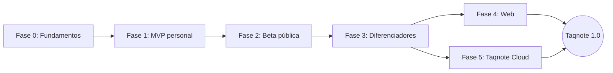

# Taqnote: visión y roadmap

Última actualización: 2026-10-08. Este documento dice a dónde va Taqnote; el estado de cada funcionalidad vive en GitHub Issues. Los criterios de salida de cada fase son metas propuestas y se ajustan al cerrarla.

## Norte

Taqnote es un taquígrafo para reuniones: escucha, transcribe y entrega una minuta revisada cuyos acuerdos terminan como tareas en la herramienta del usuario. Funciona con Teams, Google Meet y Zoom sin bots, prioriza el español y es gratis por defecto.

**Métrica norte:** reuniones por semana cuya minuta revisada llega a la herramienta del usuario (Notion, Microsoft To Do o Lists, Google Calendar o Tasks, Markdown).

## Para quién

- Profesionales y pymes hispanohablantes con reuniones en Teams, Meet y Zoom.
- Estudiantes con clases virtuales.
- Organizaciones que llevan actas formales: juntas directivas, asambleas y comités.

## Principios

1. **Local primero.** El audio no sale del equipo salvo que el usuario elija la nube.
2. **Gratis por defecto.** Solo se cobra la comodidad de Taqnote Cloud.
3. **Open source completo.** Sin funciones cerradas en la app: se cobra por el servicio, no por el código.
4. **Sin bots.** Se captura el audio del sistema; nadie extra entra a la reunión.
5. **Español primero.** Plantillas, glosario y calidad se miden en español.
6. **Revisión y trazabilidad.** Nada se exporta sin revisión, y cada punto de la minuta enlaza al fragmento del transcript que lo respalda.
7. **Privacidad por diseño.** Sin telemetría por defecto; Taqnote Cloud procesa sin guardar.
8. **Integrarse, no reemplazar.** Minutas y tareas terminan en las apps que el usuario ya usa; Taqnote no es otro gestor de tareas.

## Fuera de alcance

| Decisión | Por qué | Se revisa si… |
| --- | --- | --- |
| Sin bots en las reuniones | Cuestan un servidor por reunión y muchas empresas los bloquean | No se revisa |
| Sin integración con Microsoft Loop | No tiene API pública de escritura | Microsoft publica una |
| Sin autenticación propia desde cero | Riesgo de seguridad sin beneficio | No se revisa |
| Sin guardar audio ni transcripciones en servidores | Privacidad y responsabilidad legal | Se agrega sincronización cifrada de extremo a extremo |
| Sin app móvil nativa antes de 1.0 | El foco es escritorio | Hay demanda para reuniones presenciales |
| Sin transcripción palabra por palabra | Bloques de ~30 s bastan y son más simples | Los usuarios lo piden con datos |

## Destino: Taqnote 1.0

Taqnote 1.0 es una app de escritorio firmada para Windows y macOS, una versión web y el plan Taqnote Cloud. Captura cualquier reunión sin bots y transcribe en local o en la nube según el equipo. Entrega minutas en español con plantillas y trazabilidad, convierte los acuerdos en tareas con seguimiento y las envía a Notion, Microsoft To Do y Lists, y Google Calendar, Tasks y Docs. Además, permite buscar en el historial.

## Integraciones

| App | Qué recibe | Cuentas | Fase |
| --- | --- | --- | --- |
| Markdown | La minuta | Ninguna | 1 |
| Notion | Minuta y tareas del equipo, con responsable | Token interno (F1), OAuth (F2) | 1 / 2 |
| Microsoft To Do | Compromisos del usuario, con fecha, recordatorio y enlace a la minuta | Personal y de trabajo | 1 |
| Microsoft Lists | Tareas del equipo en una lista de SharePoint | Solo de trabajo o escuela | 2 |
| Google Calendar | Seguimientos y bloques de tiempo como eventos | Personal y Workspace | 2 |
| Google Tasks | Compromisos del usuario con fecha, sin hora | Personal y Workspace | 2 |
| Google Docs (Drive) | La minuta como documento | Personal y Workspace | 2 |
| Microsoft Planner y OneNote | Tareas de equipo y minuta | De trabajo | 3 |

Google Drive no maneja tareas: las tareas van a Google Tasks (visibles en Google Calendar) o como eventos de Calendar, y la minuta se guarda como Google Doc en Drive. To Do y Google Tasks son listas personales, así que reciben los compromisos del usuario; las tareas de otras personas van a Notion o Lists.

## Roadmap

Las fases 4 y 5 pueden avanzar en paralelo. Cada funcionalidad tiene un ID que se usa como prefijo del título de su Issue.

### Fase 0: Fundamentos

Objetivo: el repo listo para construir y el mayor riesgo técnico probado.

- **DOC-01** Docs y ADRs iniciales en `docs/`.
- **DOC-02** Elegir la licencia (MIT/Apache o AGPL) antes del primer contribuidor externo.
- **DIS-01** Monorepo: `packages/core`, `packages/ui` y `apps/desktop` con Tauri 2, React, Vite y Tailwind.
- **DIS-02** CI en GitHub Actions: lint, pruebas y build de Windows.
- **CAP-00** Spike: grabar micrófono y audio del sistema por separado en Windows desde Rust y transcribirlo en GPU.

**Salida:** el spike transcribe 10 minutos de una reunión real sin perder audio.

### Fase 1: MVP personal (Windows)

Objetivo: usarlo en reuniones propias, de punta a punta.

- **CAP-01** Captura de micrófono y audio del sistema (WASAPI loopback) en canales separados.
- **CAP-02** Grabación resiliente en bloques: un cierre inesperado no pierde la reunión.
- **CAP-03** Bloques de ~30 s cortados por silencios (VAD).
- **TRN-01** Transcripción local con whisper.cpp (CUDA, Vulkan o CPU).
- **TRN-02** Transcripción casi en vivo en pantalla.
- **TRN-03** Glosario de nombres y términos como prompt inicial.
- **MIN-01** Minuta con LLM local vía Ollama y plantilla base: asistentes, temas, acuerdos y pendientes.
- **MIN-02** Revisión y edición antes de exportar.
- **MIN-03** Trazabilidad: cada punto enlaza al timestamp del transcript.
- **TAR-01** Extracción de acuerdos con responsable y fecha.
- **INT-01** Capa de conectores: modelo de tarea común, enrutamiento por responsable y registro de exportaciones idempotente.
- **EXP-01** Exportar a Markdown local.
- **EXP-02** Exportar a Notion con token interno: página de minuta y filas en una base de tareas, con troceo e idempotencia.
- **INT-02** OAuth de escritorio con PKCE y redirección loopback, reutilizable por proveedor.
- **EXP-04** Microsoft To Do: compromisos del usuario con fecha, recordatorio y enlace a la minuta.
- **UX-01** Hotkey para marcar un momento importante.
- **PRV-01** Datos en SQLite local y audio borrado tras transcribir (configurable).
- **PRV-02** Keys y tokens OAuth guardados en el keychain del sistema.

**Salida:** 10 reuniones reales en dos semanas, minutas en Notion, compromisos en To Do y cero audio perdido.

### Fase 2: Beta pública (Windows)

Objetivo: que cualquier persona con Windows lo instale y funcione en su equipo.

- **HW-01** Mínimos duros (sistema, RAM, disco) con bloqueo.
- **HW-02** Benchmark de onboarding (RTF y WER) que habilita el modo en vivo, al terminar o bloqueado.
- **HW-03** Motor por etapa: local, key propia o Taqnote Cloud.
- **TRN-04** Parakeet v3 como motor rápido para CPU, medido con acentos latinoamericanos.
- **TRN-05** Transcripción en la nube con key propia (OpenAI, Groq).
- **MIN-04** Minuta en la nube con key propia, mediante un adaptador compatible con la API de OpenAI.
- **EXP-03** Conexión con Notion para cualquier usuario vía OAuth, con un Worker que hace el intercambio y la renovación de tokens, porque Notion exige el client secret.
- **EXP-09** Microsoft Lists: tareas del equipo en una lista de SharePoint (cuentas de trabajo o escuela).
- **EXP-10** Google Calendar: seguimientos y bloques de tiempo como eventos; invitar a otras personas solo con confirmación explícita.
- **EXP-11** Google Tasks: compromisos del usuario con fecha.
- **EXP-12** Google Docs: la minuta como documento en Drive.
- **INT-03** Verificación de la app ante Google (scopes sensibles de Calendar) y como publisher en Microsoft, para que cualquier usuario pueda conectar sus cuentas.
- **PRV-03** Aviso de grabación para los participantes.
- **UX-02** Onboarding: permisos, descarga de modelos desde Hugging Face y benchmark.
- **DIS-03** Instalador firmado (SignPath o Microsoft Store) y auto-actualización.
- **DIS-04** Prueba de regresión de WER con audios en español en el CI.
- **DIS-05** Landing y documentación en Cloudflare Pages.
- **DIS-06** Donaciones con GitHub Sponsors.

**Salida:** 10 usuarios externos lo usan una semana sin ayuda, conectan sus apps y lo instalan sin advertencias de seguridad.

### Fase 3: Diferenciadores

Objetivo: lo que separa a Taqnote de Meetily y de las herramientas pensadas en inglés.

- **TAR-02** "Mis compromisos": lo que el usuario prometió, detectado en su canal de micrófono.
- **TAR-03** Seguimiento entre reuniones: la siguiente reunión abre con los pendientes de la anterior.
- **EXP-08** Microsoft Planner vía Microsoft Graph.
- **EXP-05** OneNote vía Microsoft Graph.
- **EXP-06** Exportar a PDF y DOCX.
- **EXP-07** Borrador de correo con la minuta para los asistentes.
- **MIN-05** Plantillas: acta formal, standup, 1:1, reunión con cliente y clase.
- **MIN-06** Reunión en inglés con minuta en español, y al revés.
- **MIN-07** Resumen por partes para reuniones de más de una hora.
- **TRN-06** Diarización: "tú vs. resto" por canales y separación de hablantes con modelo.
- **TRN-07** Glosario que aprende de las correcciones.
- **UX-03** Hotkey "¿qué me perdí?": resumen de los últimos 5 minutos.
- **UX-04** Detección automática de reuniones de Teams, Meet y Zoom.
- **UX-05** Calendario (Google, Outlook) para título y asistentes.
- **PRV-04** Anonimización local de cédulas, IBAN, tarjetas y correos antes de enviar texto a la nube.
- **HIS-01** Búsqueda de texto completo en el historial (SQLite FTS5).
- **HIS-02** Preguntas sobre el historial con embeddings.
- **DIS-07** Versión de macOS 14.2+ firmada y notarizada.

**Salida:** en una encuesta, la mayoría de los usuarios beta nombra un diferenciador como su razón para quedarse, y la versión de macOS está publicada.

### Fase 4: Web

Objetivo: usar Taqnote sin instalar nada, con el mismo núcleo.

- **WEB-01** PWA en React con `packages/core` y `packages/ui` compartidos.
- **WEB-02** Captura de micrófono y de audio de pestaña o del sistema.
- **WEB-03** Subida de grabaciones existentes.
- **WEB-04** Datos en IndexedDB y transcripción con key propia o Taqnote Cloud.
- **WEB-05** Extensión de Chrome que captura la pestaña sin el diálogo de compartir pantalla.

**Salida:** una reunión de Google Meet produce en la web la misma minuta que en escritorio.

### Fase 5: Taqnote Cloud

Objetivo: que quien no tiene GPU ni API keys pague por comodidad, con costo fijo cero.

- **CLD-01** Backend en Cloudflare Workers + D1.
- **CLD-02** Checkout de Paddle y webhook que genera licencias.
- **CLD-03** Activación de licencia en app y web, con límite de dispositivos y recuperación.
- **CLD-04** Proxy sin estado a Groq (transcripción) y a un LLM económico (minuta).
- **CLD-05** Cuotas por licencia y pantalla de uso.
- **CLD-06** Política de privacidad, términos y precios.

**Salida:** primeros suscriptores con margen positivo por usuario.

## Ideas en espera (después de 1.0)

- Importar transcripciones de Teams vía Microsoft Graph.
- Outlook Calendar vía Microsoft Graph.
- Cuentas y sincronización cifrada entre dispositivos.
- Espacios compartidos para equipos.
- App móvil para reuniones presenciales.
- Integraciones con Jira, ClickUp, Trello y Google Docs.
- Linux con PipeWire.

## Cómo se usa este documento

- Este archivo es el mapa; el estado de cada funcionalidad vive en GitHub Issues.
- Cada ID es el prefijo del título de su Issue, y cada fase es un Milestone.
- Los IDs no se renumeran: una funcionalidad nueva toma el siguiente número libre de su prefijo, aunque quede fuera de orden.
- Una idea nueva entra primero en "Ideas en espera" y pasa al roadmap solo si acerca la métrica norte.
- Un cambio de rumbo se registra como ADR en `docs/adr/` y después se refleja aquí.
- El documento se revisa al cerrar cada fase.
