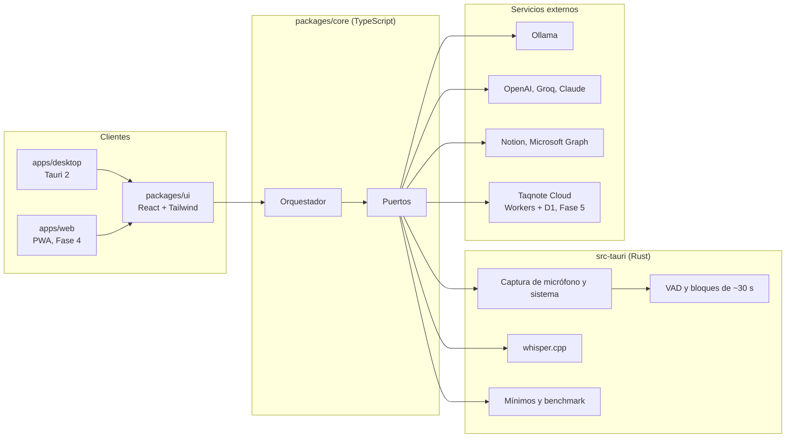
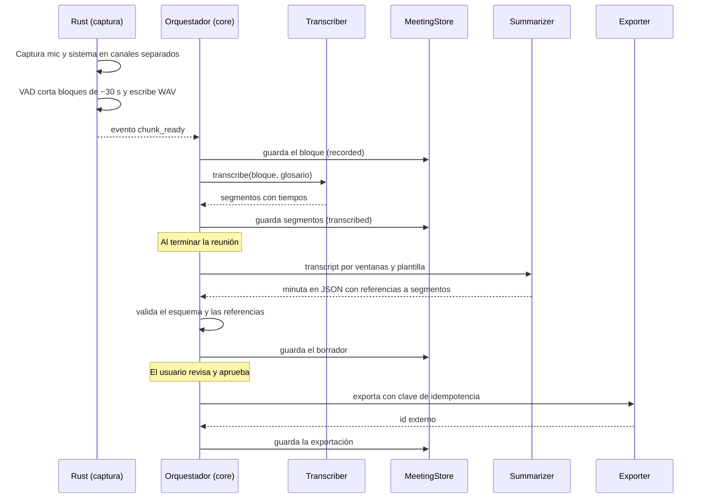
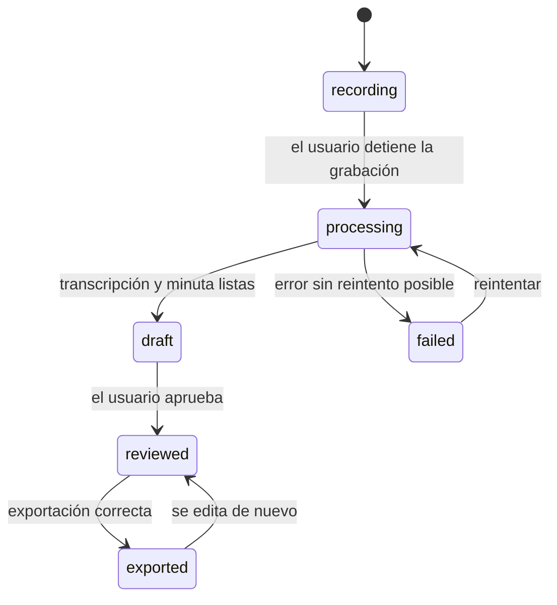
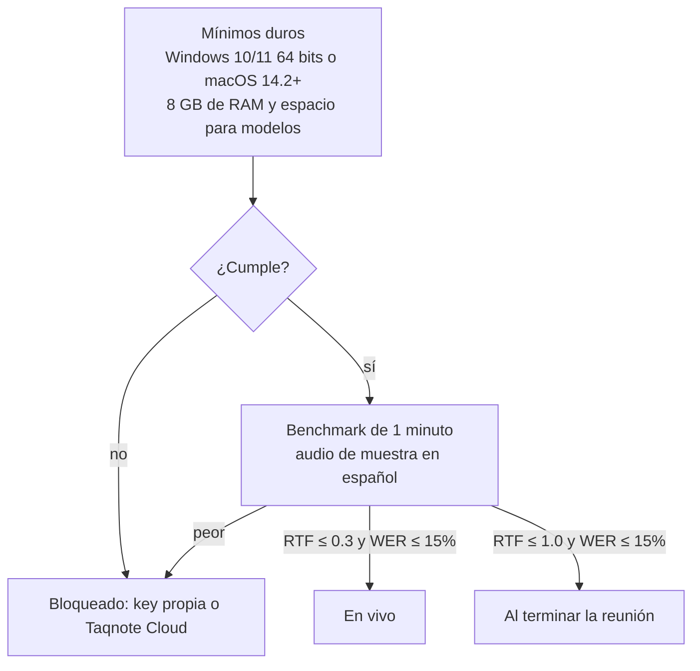

# Taqnote: arquitectura

Última actualización: 2026-10-08 · Relacionado: [roadmap](roadmap.md) · [plan de implementación](plan/implementacion.md) · [ADRs](adr/)

Taqnote es un núcleo en TypeScript con adaptadores por plataforma. La app de escritorio (Tauri 2) aporta en Rust la captura de audio, la inferencia local y el filtro de hardware; la web aporta adaptadores del navegador, y Taqnote Cloud es un Worker sin estado. Este documento describe el estado objetivo, y cada sección indica en qué fase aparece.

## Vista general



## Principios de diseño

- **Núcleo agnóstico de plataforma.** `packages/core` no importa Tauri ni APIs del navegador; todo entra por puertos.
- **Rust solo para lo nativo.** Captura, VAD, inferencia local y filtro de hardware. La orquestación, los prompts y las exportaciones viven en TypeScript.
- **Local-first.** SQLite en escritorio e IndexedDB en web; ningún servidor guarda reuniones.
- **Motor por etapa.** Transcripción y minuta eligen su motor por separado: local, key propia o Taqnote Cloud.
- **Fallar sin perder datos.** El audio se escribe en bloques cerrados y cada bloque tiene estado.

## Estructura del repositorio

```
taqnote/
├── apps/
│   ├── desktop/          Tauri 2: frontend React (src/) y backend Rust (src-tauri/)
│   ├── web/              PWA (Fase 4)
│   └── cloud/            Cloudflare Worker (Fase 5)
├── packages/
│   ├── core/             dominio, puertos, orquestador, prompts y exportadores
│   └── ui/               componentes React compartidos
├── spikes/               experimentos desechables (CAP-00)
├── fixtures/audio/       audios en español con transcripción de referencia
├── docs/
└── .github/workflows/
```

## Puertos y adaptadores

| Puerto | Responsabilidad | Escritorio | Web | Fase |
| --- | --- | --- | --- | --- |
| `AudioSource` | Entregar bloques de audio por canal | Rust: cpal y wasapi, vía eventos de Tauri | getUserMedia y getDisplayMedia con AudioWorklet | 1 / 4 |
| `Transcriber` | Bloque → segmentos con tiempos | whisper.cpp en Rust; OpenAI y Groq por HTTP | OpenAI, Groq o Cloud | 1 / 2 |
| `Summarizer` | Transcript → minuta estructurada | Ollama; luego API compatible con OpenAI | API compatible con OpenAI o Cloud | 1 / 2 |
| `MeetingStore` | Persistir reuniones, segmentos y minutas | SQLite (tauri-plugin-sql) | IndexedDB | 1 / 4 |
| `Exporter` | Enviar minuta y tareas a su destino | Markdown y Notion; luego Microsoft Graph | Igual, con proxy si hay CORS | 1 / 3 |
| `SecretStore` | Guardar keys y tokens | Carpeta de configuración (F1), keychain (F2) | Almacenamiento del navegador | 1 / 2 |

El contrato principal, en `packages/core`:

```ts
export type Channel = 'mic' | 'system'; // mic = el usuario, system = los demás

export interface AudioChunk {
  meetingId: string;
  channel: Channel;
  seq: number;
  startMs: number; // relativo al inicio de la reunión
  endMs: number;
  uri: string;     // WAV PCM 16 kHz mono
}

export interface Segment {
  id: string;
  chunkSeq: number;
  channel: Channel;
  startMs: number;
  endMs: number;
  text: string;
}

export interface Transcriber {
  readonly id: string; // 'local-whisper' | 'groq' | 'openai' | 'cloud'
  transcribe(chunk: AudioChunk, opts: { language: string; prompt?: string }): Promise<Segment[]>;
}

export interface Summarizer {
  readonly id: string;
  summarize(input: { segments: Segment[]; template: string; language: string }): Promise<Minute>;
}

export interface Exporter {
  readonly target: 'markdown' | 'notion';
  export(minute: Minute, previous?: ExportRef): Promise<ExportRef>; // idempotente
}
```

## Pipeline de una reunión



### Captura (CAP-01 a CAP-03)

El micrófono se captura con cpal y el audio del sistema con loopback de WASAPI mediante el crate `wasapi`, que soporta esa captura de forma explícita. Cada canal se convierte a 16 kHz mono y se guarda por separado: el canal `mic` es el usuario y el canal `system`, el resto de la reunión. El loopback puede no entregar datos mientras no suena nada, así que la grabadora rellena esos huecos con silencio según el reloj para no desalinear los tiempos.

El VAD corta los bloques en silencios con un objetivo de 30 s, un mínimo de 10 s y un máximo de 40 s. El mínimo coincide con el cobro mínimo de Groq por solicitud, y 30 s es el segmento para el que Groq optimiza Whisper Turbo. Cada bloque es un WAV PCM de 16 bits (unos 0,96 MB por 30 s) que se escribe en un archivo temporal y se renombra al cerrarse, así que un cierre inesperado solo deja bloques completos. El nombre del archivo lleva canal, secuencia y tiempos (`mic-0007-210000-240000.wav`), de modo que la recuperación puede reconstruir los bloques aunque la base de datos no los tenga.
c
### Transcripción (TRN-01 a TRN-03)

La transcripción local usa whisper.cpp a través de whisper-rs, que hoy se mantiene en Codeberg y ofrece las features `vulkan`, `cuda` y `metal`. Una cola procesa un bloque a la vez para no competir por la GPU. El idioma por defecto es `es` y el glosario se pasa como prompt inicial. Los modelos se descargan desde Hugging Face a la carpeta de datos de la app y se verifican con el SHA publicado.

La transcripción en la nube envía el mismo bloque a OpenAI o Groq, detrás del mismo puerto `Transcriber`. En escritorio, las llamadas HTTP pasan por tauri-plugin-http para evitar las restricciones de CORS del WebView.

### Minuta (MIN-01 a MIN-03, TAR-01)

El LLM devuelve JSON validado con Zod. Cada punto lleva `refs` a ids de segmentos, y el orquestador marca o descarta los puntos cuyas referencias no existen: es la principal defensa contra acuerdos inventados.

```ts
const Minute = z.object({
  titulo: z.string(),
  asistentes: z.array(z.string()),
  temas: z.array(z.object({ titulo: z.string(), resumen: z.string(), refs: z.array(z.string()) })),
  acuerdos: z.array(z.object({
    texto: z.string(),
    responsable: z.string().nullable(),
    fecha: z.string().nullable(), // ISO 8601
    refs: z.array(z.string()),
  })),
  pendientes: z.array(z.object({ texto: z.string(), refs: z.array(z.string()) })),
});
```

El resumen trabaja por ventanas de ~10 minutos y una fusión final desde la Fase 1, porque una reunión de una hora no cabe en el contexto de un modelo local de 8–14B. Con Ollama, el tamaño de contexto (`num_ctx`) se fija de forma explícita, porque el valor por defecto es corto.

La trazabilidad apunta al segmento del transcript y su tiempo. Si el usuario conserva el audio, además permite reproducir ese momento; por defecto el audio se borra tras transcribir (PRV-01).

### Exportación (EXP-01, EXP-02)

El render a Markdown es el canónico: es la salida de EXP-01 y la base de lo que se envía a Notion.

Notion se usa con el header `Notion-Version: 2025-09-03`. En esa versión una base puede tener varios data sources, y las páginas se crean con un parent de tipo `data_source_id`. Taqnote usa dos data sources relacionados: Minutas y Tareas. Los límites que obligan a trocear son 2000 caracteres por texto, arreglos de hasta 100 elementos y payloads de hasta 1000 bloques y 500 KB. El límite de tráfico es de 3 solicitudes por segundo en promedio por integración, y un 429 se reintenta respetando `Retry-After`. La tabla `exports` guarda el id de la página, así que reexportar actualiza la misma página en vez de duplicarla.

## Modelo de datos (SQLite)

Cada conexión activa `PRAGMA foreign_keys = ON`. Los tiempos de segmentos y bloques son milisegundos relativos al inicio de la reunión.

```sql
CREATE TABLE meetings (
  id          TEXT PRIMARY KEY,               -- UUID v7
  title       TEXT NOT NULL,
  started_at  TEXT NOT NULL,                  -- ISO 8601 UTC
  ended_at    TEXT,
  status      TEXT NOT NULL,                  -- recording | processing | draft | reviewed | exported | failed
  language    TEXT NOT NULL DEFAULT 'es',
  template    TEXT NOT NULL DEFAULT 'base',
  asr_engine  TEXT NOT NULL,                  -- local-whisper | groq | openai | cloud
  llm_engine  TEXT NOT NULL                   -- ollama | openai-compatible | cloud
);

CREATE TABLE chunks (
  id          TEXT PRIMARY KEY,
  meeting_id  TEXT NOT NULL REFERENCES meetings(id) ON DELETE CASCADE,
  channel     TEXT NOT NULL CHECK (channel IN ('mic', 'system')),
  seq         INTEGER NOT NULL,
  start_ms    INTEGER NOT NULL,
  end_ms      INTEGER NOT NULL,
  path        TEXT,                           -- NULL cuando el audio ya se borró
  status      TEXT NOT NULL,                  -- recorded | transcribing | transcribed | failed
  attempts    INTEGER NOT NULL DEFAULT 0,
  UNIQUE (meeting_id, channel, seq)
);

CREATE TABLE segments (
  id          TEXT PRIMARY KEY,
  meeting_id  TEXT NOT NULL REFERENCES meetings(id) ON DELETE CASCADE,
  chunk_id    TEXT NOT NULL REFERENCES chunks(id) ON DELETE CASCADE,
  channel     TEXT NOT NULL,
  start_ms    INTEGER NOT NULL,
  end_ms      INTEGER NOT NULL,
  text        TEXT NOT NULL,
  speaker     TEXT                            -- Fase 3 (TRN-06)
);

CREATE TABLE markers (
  id          TEXT PRIMARY KEY,
  meeting_id  TEXT NOT NULL REFERENCES meetings(id) ON DELETE CASCADE,
  at_ms       INTEGER NOT NULL,
  kind        TEXT NOT NULL DEFAULT 'important',
  note        TEXT
);

CREATE TABLE minutes (
  id            TEXT PRIMARY KEY,
  meeting_id    TEXT NOT NULL REFERENCES meetings(id) ON DELETE CASCADE,
  version       INTEGER NOT NULL,
  content_json  TEXT NOT NULL,                -- validado con el esquema Zod
  content_md    TEXT NOT NULL,                -- render canónico
  reviewed_at   TEXT,
  UNIQUE (meeting_id, version)
);

CREATE TABLE action_items (
  id          TEXT PRIMARY KEY,
  minute_id   TEXT NOT NULL REFERENCES minutes(id) ON DELETE CASCADE,
  text        TEXT NOT NULL,
  owner       TEXT,
  due_date    TEXT,
  refs        TEXT NOT NULL,                  -- JSON con ids de segmentos
  status      TEXT NOT NULL DEFAULT 'open'
);

CREATE TABLE exports (
  id           TEXT PRIMARY KEY,
  meeting_id   TEXT NOT NULL REFERENCES meetings(id) ON DELETE CASCADE,
  target       TEXT NOT NULL,                 -- markdown | notion
  external_id  TEXT,                          -- id de la página en Notion: clave de idempotencia
  exported_at  TEXT NOT NULL,
  UNIQUE (meeting_id, target)
);

CREATE TABLE glossary (
  term  TEXT PRIMARY KEY,
  kind  TEXT NOT NULL DEFAULT 'term'          -- person | project | term
);

CREATE TABLE benchmarks (
  id       TEXT PRIMARY KEY,
  run_at   TEXT NOT NULL,
  model    TEXT NOT NULL,
  backend  TEXT NOT NULL,                     -- cuda | vulkan | metal | cpu
  rtf      REAL NOT NULL,
  wer      REAL NOT NULL,
  mode     TEXT NOT NULL                      -- live | post | blocked
);
```

## Ciclo de vida de una reunión



Cada bloque pasa por `recorded → transcribing → transcribed`, o por `failed` con reintentos y backoff. Al iniciar la app, una reunión en `recording` sin grabadora activa pasa a `processing` con los bloques que ya están en disco, y los bloques que quedaron en `transcribing` vuelven a `recorded`.

## Filtro de hardware y motor por etapa (Fase 2)



El módulo `hw` en Rust reporta sistema, RAM y disco libre, y corre el benchmark con un audio de 60 s en español de licencia libre (grabación propia o Common Voice) y su transcripción de referencia. Prueba los modelos de mayor a menor calidad en cada backend disponible, guarda el resultado en `benchmarks` y habilita los modos permitidos. El LLM local se mide aparte, en tokens por segundo.

El instalador de Windows usará Vulkan con respaldo en CPU, que cubre GPUs de NVIDIA, AMD e Intel sin distribuir el runtime de CUDA. CUDA queda como build opcional: en las RTX 50 (Blackwell) exige CUDA Toolkit 12.8 o superior y driver R570 o superior.

## Seguridad y privacidad

- Ninguna key vive en el repo. En la Fase 1 el token de Notion se guarda en la carpeta de configuración de la app; desde la Fase 2, en el keychain del sistema.
- Las capabilities de Tauri habilitan solo los permisos de plugins que se usan, con una CSP estricta y sin contenido remoto en el WebView.
- El audio de cada bloque se borra tras transcribirse, salvo que el usuario elija conservarlo.
- A la nube solo sale lo que exige el motor elegido: el bloque de audio o el texto. Desde la Fase 3, los datos personales se enmascaran antes (PRV-04).
- Los logs nunca incluyen texto de reuniones ni keys.

## Taqnote Cloud (Fase 5)

Un Cloudflare Worker sin estado frente a Groq y a un LLM económico, con D1 para licencias y cuotas. Ni el audio ni el texto se guardan: pasan y se descartan.

| Endpoint | Función |
| --- | --- |
| `POST /v1/licenses/activate` | Registra el dispositivo contra la licencia |
| `POST /v1/transcribe` | Reenvía un bloque a Groq y devuelve segmentos |
| `POST /v1/summarize` | Reenvía la transcripción al LLM y devuelve la minuta |
| `GET /v1/usage` | Devuelve la cuota usada y la disponible |
| `POST /webhooks/paddle` | Verifica la firma y crea o actualiza licencias |

D1 guarda `licenses` (hash de la clave, estado, plan, id de suscripción de Paddle, fin del periodo), `activations` (licencia, dispositivo, último uso) y `usage` (licencia, periodo, segundos de audio, tokens). La clave de licencia nunca se guarda en claro. Los 10 ms de CPU por invocación del plan gratuito alcanzan porque el proxy pasa casi todo el tiempo esperando la respuesta del proveedor.

## Web (Fase 4)

La PWA reutiliza `packages/core` y `packages/ui` con adaptadores propios: captura con getUserMedia y getDisplayMedia, VAD en un AudioWorklet, IndexedDB como `MeetingStore` y transcripción solo en la nube. Si la API de Notion no acepta llamadas desde el navegador por CORS, la exportación pasa por un proxy en el Worker; hay que verificarlo al llegar a esa fase.

## Decisiones

Registradas:

- [0001: Tauri 2 + React para escritorio](adr/0001-tauri-react-escritorio.md)
- [0002: Captura del audio del sistema, sin bots](adr/0002-captura-audio-sistema-sin-bots.md)
- [0003: Local-first, sin servidor en el MVP](adr/0003-local-first-sin-servidor-en-mvp.md)
- [0004: Licencias en vez de cuentas](adr/0004-licencias-en-vez-de-cuentas.md)
- [0005: Workers + D1 en vez de RDS](adr/0005-workers-d1-en-vez-de-rds.md)
- [0006: Modo local habilitado por benchmark](adr/0006-modo-local-por-benchmark.md)

Pendientes, cada una con su ADR al llegar:

- Biblioteca de VAD, tras el spike CAP-00.
- Backend de GPU por defecto del instalador (Vulkan o CUDA), tras el spike CAP-00.
- Captura en macOS: Core Audio taps (macOS 14.2+) o cpal, que documenta loopback desde macOS 14.6. Antes de DIS-07.
- Licencia del proyecto (DOC-02).

## Referencias

- [Notion: guía de la versión 2025-09-03](https://developers.notion.com/docs/upgrade-guide-2025-09-03)
- [Notion: límites de solicitud](https://developers.notion.com/reference/request-limits) · [límites de tráfico](https://developers.notion.com/reference/rate-limits)
- [Crate wasapi (loopback)](https://docs.rs/wasapi) · [cpal](https://github.com/RustAudio/cpal)
- [whisper-rs (se mantiene en Codeberg)](https://codeberg.org/tazz4843/whisper-rs)
- [Modelos de whisper.cpp en Hugging Face](https://huggingface.co/ggerganov/whisper.cpp)
- [Groq: Whisper Large v3 Turbo](https://console.groq.com/docs/model/whisper-large-v3-turbo)
- [NVIDIA: guía de migración a Blackwell](https://forums.developer.nvidia.com/t/software-migration-guide-for-nvidia-blackwell-rtx-gpus-a-guide-to-cuda-12-8-pytorch-tensorrt-and-llama-cpp/321330)
- [Tauri 2: prerrequisitos](https://v2.tauri.app/start/prerequisites/)
